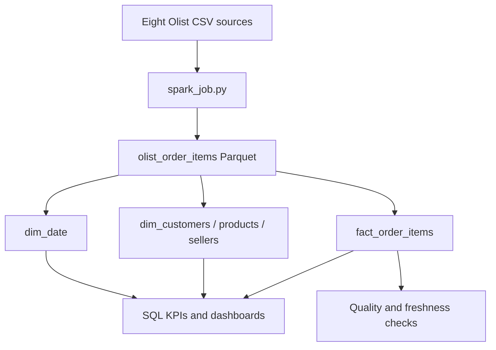

# Data lineage and ownership

The warehouse separates source ingestion, a validated integration layer, dimensional models, tests, and downstream analytics.

| Source | Integration treatment | Dimensional target | Downstream use |
| --- | --- | --- | --- |
| orders | Unique order, parsed purchase timestamp | fact_order_items, dim_date | Order volume and time trends |
| order_items | Unique order-item grain | fact_order_items | Revenue and fulfillment metrics |
| customers | Latest record per unique customer | dim_customers | Regional and repeat-customer KPIs |
| products + translation | One translated category per product | dim_products | Category performance |
| sellers | One row per seller | dim_sellers | Seller and regional analysis |
| payments | Aggregated to order before joining | fact_order_items | Payment reconciliation |
| reviews | Averaged to order before joining | fact_order_items | Satisfaction monitoring |

## Contracts

- **Fact grain:** one row per `order_id + order_item_id`.
- **Keys:** deterministic SHA-256 warehouse keys make rebuilds idempotent while natural keys preserve traceability.
- **Quality owner:** the pipeline run owner reviews failed assertions before publishing downstream models.
- **Freshness objective:** the fact table must contain a `loaded_at` timestamp no older than the configured threshold (30 hours by default).
- **Failure behavior:** SQL assertions must return zero rows; the freshness monitor emits JSON and exits nonzero when stale or empty.
- **Disclosure:** account-specific S3 paths and operational logs are excluded from the public repository.
